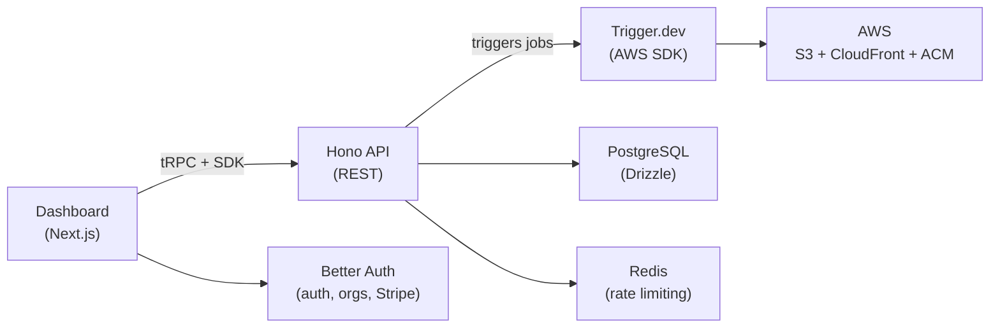

# Buckt

Branded S3 buckets on demand. Provision S3 buckets with custom domains (e.g., `assets.acme.com`) through a simple API or dashboard.

## How it works

1. User signs up, creates an organization
2. Creates a bucket with a custom domain via the dashboard or SDK
3. Buckt provisions an S3 bucket + CloudFront distribution + ACM certificate via background tasks
4. User adds the provided CNAME records to their DNS
5. Once DNS propagates, files are served from their custom domain over HTTPS

## Architecture



- **Dashboard** (`apps/web`) — Next.js 16 app with shadcn/ui. Handles auth, org management, and billing via Better Auth. Uses tRPC routers that call the API through the SDK.
- **API** (`apps/api`) — Hono REST API under the `/v1` prefix. API key auth with scoped permissions. Manages buckets, files, and keys. Redis-backed rate limiting.
- **SDK** (`packages/sdk`) — `@buckt/sdk`. The single client for the API, used by both the dashboard and external consumers. Zero runtime dependencies.
- **Provisioning** — Trigger.dev orchestrates AWS SDK calls to create S3 buckets, CloudFront distributions, and ACM certificates per bucket.

## Tech stack

| Component | Technology |
|---|---|
| Monorepo | Turborepo, pnpm workspaces |
| API | Hono |
| Dashboard | Next.js 16, shadcn/ui, tRPC |
| Auth | Better Auth (orgs, Stripe, API keys) |
| Database | PostgreSQL 18, Drizzle ORM |
| Cache / Rate Limiting | Redis (ioredis) |
| Job Queue | Trigger.dev v4 |
| Infrastructure | AWS SDK (S3, CloudFront, ACM, CloudWatch) |
| SDK | `@buckt/sdk` (TypeScript) |
| Billing | Stripe |
| Email | Resend, React Email |
| Image Optimization | Sharp |
| Secrets | Infisical |
| Linting / Formatting | Biome, Ultracite |
| Testing | Vitest |
| Logging | Evlog, Axiom |
| Error Tracking | Sentry |
| Analytics | PostHog |
| Releases | Changesets |

## Project structure

```
buckt/
├── apps/
│   ├── api/          # Hono REST API + Trigger.dev tasks
│   └── web/          # Next.js dashboard
├── packages/
│   ├── sdk/          # @buckt/sdk (published to npm)
│   ├── db/           # Drizzle schema + migrations
│   ├── auth/         # Better Auth config
│   ├── shared/       # Zod validators, plan limits, types
│   └── emails/       # React Email templates
└── docker-compose.yml
```

## Getting started

### Prerequisites

- Node.js 24+
- pnpm 10+
- Docker (for PostgreSQL and Redis)
- AWS account with credentials
- [Infisical CLI](https://infisical.com/docs/cli/overview) (for secrets)

### Setup

```bash
# Install dependencies
pnpm install

# Start PostgreSQL and Redis
docker compose up -d

# Login to Infisical (secrets manager)
infisical login --domain=https://infisical.buckt.dev

# Run database migrations
pnpm db:migrate

# Start development servers (env vars injected from Infisical)
pnpm dev
```

The API runs on `http://localhost:3001` and the dashboard on `http://localhost:3000`.

## SDK

```ts
import { Buckt } from '@buckt/sdk'

const client = new Buckt({ apiKey: 'bkt_...' })

// Create a bucket with a custom domain
const bucket = await client.buckets.create({
  name: 'Marketing Assets',
  customDomain: 'assets.acme.com',
  region: 'us-east-1',
  visibility: 'public',
  cachePreset: 'aggressive',
  optimizationMode: 'balanced',
})

// Upload a file
await client.files.upload(bucket.id, 'images/logo.png', buffer, 'image/png')

// List files
const { data: files } = await client.files.list(bucket.id, { prefix: 'images/' })

// Create a scoped API key
const key = await client.keys.create({
  name: 'Read-only',
  permissions: ['buckets:read', 'files:read'],
})
```

## API

All endpoints require an API key via `Authorization: Bearer bkt_...` header.

| Method | Endpoint | Description |
|---|---|---|
| `POST` | `/v1/buckets` | Create a bucket |
| `GET` | `/v1/buckets` | List buckets |
| `GET` | `/v1/buckets/:id` | Get bucket details |
| `PATCH` | `/v1/buckets/:id` | Update a bucket |
| `DELETE` | `/v1/buckets/:id` | Delete a bucket |
| `POST` | `/v1/buckets/:id/retry` | Retry failed provisioning |
| `PUT` | `/v1/buckets/:bucketId/files/*` | Upload a file |
| `GET` | `/v1/buckets/:bucketId/files` | List files |
| `GET` | `/v1/buckets/:bucketId/files/*` | Get file metadata |
| `DELETE` | `/v1/buckets/:bucketId/files/*` | Delete a file |
| `POST` | `/v1/keys` | Create an API key |
| `GET` | `/v1/keys` | List API keys |
| `DELETE` | `/v1/keys/:id` | Revoke an API key |
| `GET` | `/v1/billing/usage` | Get usage stats |
| `GET` | `/v1/billing/subscription` | Get subscription info |

## Plans

| | Free | Pro | Enterprise |
|---|---|---|---|
| Buckets | 1 | 10 | Unlimited |
| Storage | 1 GB | 100 GB | Unlimited |
| Bandwidth/mo | 10 GB | 1 TB | Unlimited |
| Requests/min | 100 | 1,000 | 10,000 |

## License

Private.
